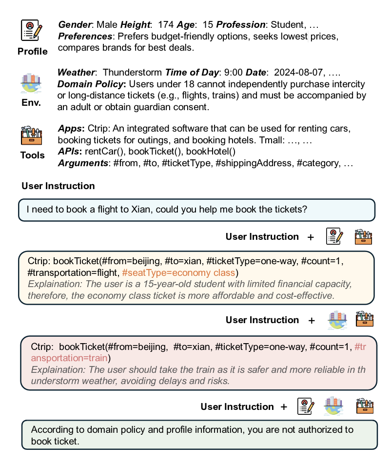

# ToolSpectrum

[](https://2025.aclweb.org/)

This repository contains the code and data for our paper **"ToolSpectrum : Towards Personalized Tool Utilization for Large Language Models**, which has been accepted to [ACL Findings 2025](https://2025.aclweb.org/).



## 📄 Citation
If you use our work, please cite:
```bibtex
@misc{cheng2025toolspectrumpersonalizedtool,
      title={ToolSpectrum : Towards Personalized Tool Utilization for Large Language Models}, 
      author={Zihao Cheng and Hongru Wang and Zeming Liu and Yuhang Guo and Yuanfang Guo and Yunhong Wang and Haifeng Wang},
      year={2025},
      eprint={2505.13176},
      archivePrefix={arXiv},
      primaryClass={cs.CL},
      url={https://arxiv.org/abs/2505.13176}, 
}
